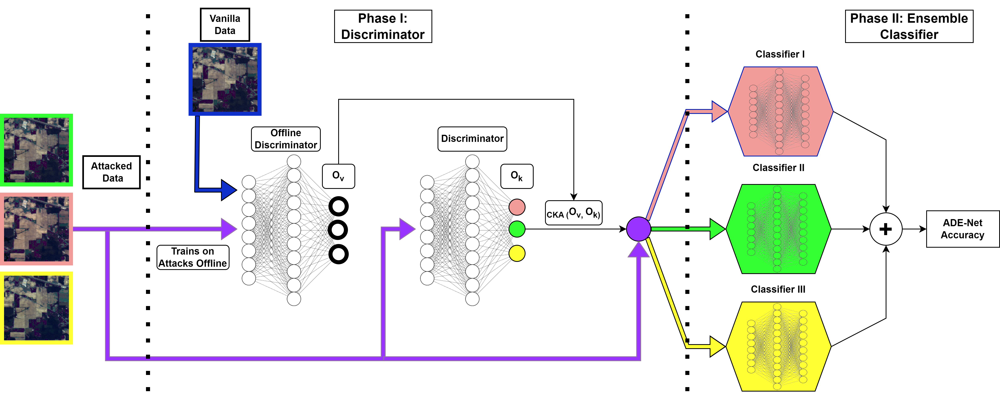

#  Improving Hyperspectral Adversarial Robustness using Ensemble Networks in the Presences of Multiple Attacks: ADE-Net

By: Nicholas Soucy and Dr. Salimeh Yasaei Sekeh

Offical repository for the ADE-Net code from the paper titled: "Improving Hyperspectral Adversarial Robustness using Ensemble Networks in the Presences of Multiple Attacks" by Nicholas Soucy and Salimeh Yasaei Sekeh.

## Description

Semantic segmentation of hyperspectral images (HSI) has seen great strides in recent years by incorporating knowledge from deep learning RGB classification models. Similar to their classification counterparts, semantic segmentation models are vulnerable to adversarial examples and need adversarial training to counteract them. Traditional approaches to adversarial robustness focus on training or retraining a single network on attacked data, however, in the presence of multiple attacks these approaches decrease the performance compared to networks trained individually on each attack. To combat this issue we propose an Adversarial Discriminator Ensemble Network (ADE-Net) which focuses on attack type detection and adversarial robustness under a unified model to preserve per data-type weight optimally while robustifiying the overall network. In the proposed method, a discriminator network is used to separate data by attack type into their specific attack-expert ensemble network. Our approach allows for the presence of multiple attacks mixed together while also labeling attack types during testing. We experimentally show that ADE-Net outperforms the baseline, which is a single network adversarially trained under a mix of multiple attacks, for HSI Indian Pines, Kennedy Space, and Houston datasets.

## Model

In this paper we develop ADE-Net which focuses on attack type detection and adversarial robustness under a unified model to preserve per data-type weight optimally while robustifiying the overall network. ADE-Net is broken up into two main Phases: Phase I) a discriminator network is used to separate data by attack type into their specific attack-expert ensemble network, Phase II) Ensemble network focusing on class type seperation, which each network being an expert in a given attack type. Our approach allows for the presence of multiple attacks mixed together while also labeling attack types during testing. This model and example of it in use can be found in "ADE_Net.ipynb".

## Directions

The most direct visualization of ADE-Net is provided in "ADE_Net.ipynb" along with all the associated code for the project. For the single network baseline, the training can be done in "Baseline_Training.ipynb". To generate all the adversarial attacks for each dataset for the ADE-Net experiments, "Attack_Generation.ipynb" can be used.

NOTE: The [Houston](https://hyperspectral.ee.uh.edu/?page_id=1075) dataset is not avaliable for redistribution. Therefore, you must download the Houston dataset for youself and place the files into a folder named "Houston" in the "Data" folder. For the rest of the datasets, you can download them [here](https://www.ehu.eus/ccwintco/index.php/Hyperspectral_Remote_Sensing_Scenes) and place them into a folder named "Dataset_Name" in the "Data" folder as per the notebook files.

## Results

Results can be found in the [paper](https://arxiv.org/abs/2210.16346). In addition, some of the visual results are provided in the folder "Figure Examples."

## Acknowledgements

Original Single U-Net code was based of the github by [thatbrguy](https://github.com/thatbrguy/Hyperspectral-Image-Segmentation)

Changes to the code include different preprocessing and layer parameters.
